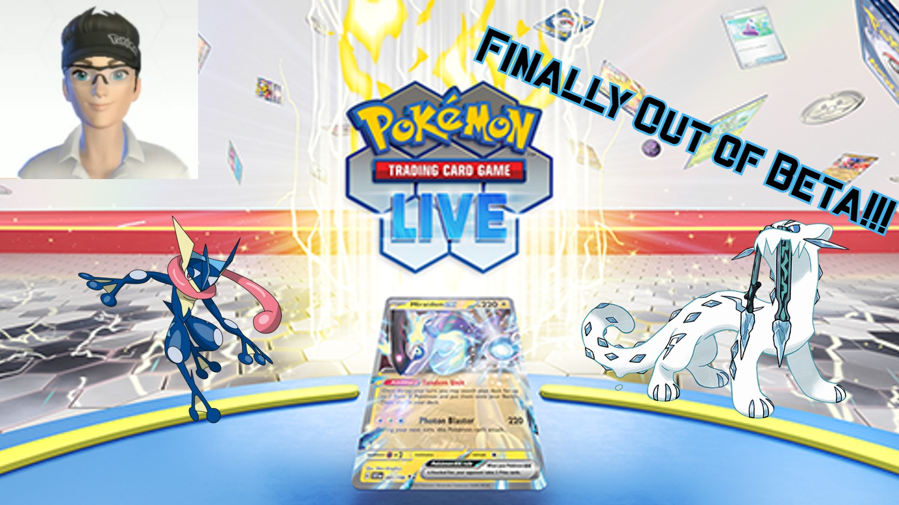

# ak2483.github.io
<!doctype html>
<html lang="en-US">
  <head>
    <meta charset="utf-8" />
    <meta name="viewport" content="width=device-width" />
    <meta name="author" content="Altan Kocatulum" />
    <title>PTCG Live Review</title>
    <link href="styles/style.css" rel="stylesheet" />
    <link
  href="https://fonts.googleapis.com/css?family=Handjet"
  rel="stylesheet" />
    <link rel="icon" href="favicon.ico" type="image/x-icon" />
  </head>
  <body>
    <!-- 4 heading levels: -->
    <h1>My First Pokémon Video</h1>
    <!-- <h2>My top level heading</h2>
    <h3>My subheading</h3>
    <h4>My sub-subheading</h4> -->
    
    
See the video <a href="https://www.youtube.com/watch?v=V2TnMIBb5mM"> here</a>. The deck showcased includes:

    <ul>
        <li> <a href="https://www.pokemon.com/us/pokemon-tcg/pokemon-cards/series/sv02/61/"> Chien-Pao EX </a> </li>
        <li> <a href="https://www.pokemon.com/us/pokemon-tcg/pokemon-cards/series/swsh10/40/"> Palkia V Origin Forme </a> </li>
        <li> <a href="https://www.pokemon.com/us/pokemon-tcg/pokemon-cards/series/swsh10/46/"> Radiant Greninja </a> </li>
        <li> <a href="https://www.pokemon.com/us/pokemon-tcg/pokemon-cards/series/sv02/58/"> Frigibax</a> + <a href="https://www.pokemon.com/us/pokemon-tcg/pokemon-cards/series/sv02/60/">Baxcalibur </a> </li>
    </ul>

    <button>Change user</button>
    
  </body>
</html>
